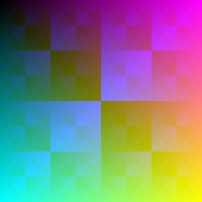
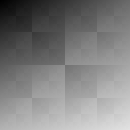
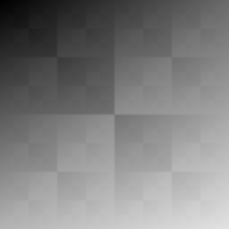

# CUDA Image Filters
GPU-accelerated image filters in modern **CUDA** with clean CPU fallback, tidy CLI and benchmark harness.

This project demonstrates image filters, such as: `sharpen`, `gaussian blur`, `sobel edge`, `box blur`, `grayscale` and many others.

# Devices
- CPU 
- GPU(CUDA of course)

## Features
- Filters:
    - Grayscale
    - Boxblur
- PPM support

## PPM Dummy

## Grayscale Filtered Dummy 

## Boxblur Filtered Dummy

## Next Steps
- Add other filters

## Tech: 
C++20, CUDA 13.0, CMake

